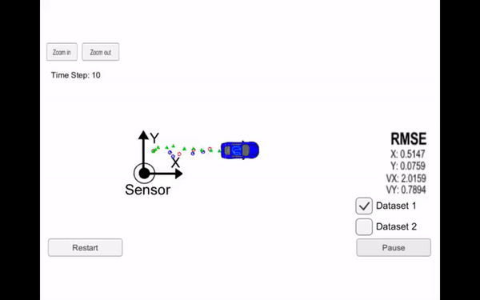

# **Extended Kalman Filter** 

**Extended Kalman Filter Project**

Now that you have learned how the extended Kalman filter works, you are going to implement the extended Kalman filter in C++. We are providing simulated lidar and radar measurements detecting a bicycle that travels around your vehicle. You will use a Kalman filter, lidar measurements and radar measurements to track the bicycle's position and velocity.

The first step is to download the Term 2 simulator, which contains all the projects for Term 2 Self-Driving Car Nanodegree. More detailed instruction about setting up the simulator with uWebSocketIO can be found at the end of this section.

Lidar measurements are red circles, radar measurements are blue circles with an arrow pointing in the direction of the observed angle, and estimation markers are green triangles. The video below shows what the simulator looks like when a c++ script is using its Kalman filter to track the object. The simulator provides the script the measured data (either lidar or radar), and the script feeds back the measured estimation marker, and RMSE values from its Kalman filter.



[//]: # (Image References)

[image1]: ./images/sensor_fusion_general_flow.png "Sensor Fusion General Flow"
[image2]: ./images/estimation_problem.png "Estimation Problem"
[image3]: ./images/state_vector.png "State Vector"
[image4]: ./images/state_vector_radar.png "State Vector - Radar"
[image5]: ./images/state_transition.png "State Transition"
[image6]: ./images/process_covariance.png "Process Covariance"
[image7]: ./images/prediction.png "Prediction"
[image8]: ./images/measurement_vector.png "Measurement Vector"
[image9]: ./images/measurement_matrix.png "Measurement Matrix"
[image10]: ./images/update.png "Update"
[image11]: ./images/update_ekf.png "Update EKF"
[image12]: ./images/y.png "y"
[image13]: ./images/y_radar.png "y radar"
[image14]: ./images/H.png "H"
[image15]: ./images/h_radar.png "h"
[image16]: ./images/jacobian.png "Hj"
[image17]: ./images/RMSE.png "RMSE"
[image18]: ./images/dataset1.png "Dataset 1"
[image19]: ./images/dataset2.png "Dataset 2"

## Dependencies

* [simulator](https://github.com/udacity/self-driving-car-sim/releases)

## Environment Setup

1. Open Eclipse IDE

__Linux__:
```
docker run --rm --name kalman \
    --net=host -e DISPLAY=$DISPLAY \
    -v $HOME/.Xauthority:/root/.Xauthority \
    dragon7/carnd-extended-kalman-filter-project
```

__Mac__:
```
socat TCP-LISTEN:6000,reuseaddr,fork UNIX-CLIENT:\"$DISPLAY\"

docker run --rm --name kalman \
    -e DISPLAY=[IP_ADDRESS]:0 \
    -p 4567:4567 \
    dragon7/carnd-extended-kalman-filter-project
```

2. Import the project into Eclipse

    1. Open Eclipse (make sure you have the CDT 4.0 or newer).

    2. Import project using Menu `File > Import`

    

    3. Select `General > Existing projects into workspace`

    

    4. **Browse** `/root/workspace/CarND-Extended-Kalman-Filter-Project/build` and select the root build 
    tree directory. Keep "Copy projects into workspace" unchecked.
    
    
    
    5. Now you should have a fully functional eclipse project
    
    

3. Code Style

    1. From Eclipse go to `Window > Preferences > C/C++ > Code Style > Formatter`
    2. Click Import
    3. Select `/root/workspace/eclipse-cpp-google-style.xml`
    4. Click Ok

4. Build

    * Select `Project -> Build All`

    

    * (optional) Build on command line
    ```
    cd /root/workspace/CarND-Extended-Kalman-Filter-Project/build
    make
    ```
5. Run

    * `Right click Project -> Run as -> 1 Local C++ Application`

    

    * (optional) Run on command line

    `./ExtendedKF`

6. Launch simulator

    

## File structure

* `src/main.cpp`

communicates with the Term 2 Simulator receiving data measurements, calls a function to run the Kalman filter, calls a function to calculate RMSE

* `src/FusionEKF.cpp`

initializes the filter, calls the predict function, calls the update function

* `src/kalman_filter.cpp`

defines the predict function, the update function for lidar, and the update function for radar

* `src/tools.cpp`

function to calculate RMSE and the Jacobian matrix

## Sensor Funsion General Flow

Belwo is the program flow of this project.

![alt text][image1]

![alt text][image2]

### initialize EKF matrices

* R: measurement noise covariance
* P: state uncertainty covariance

### initialize state, x, and covariance matrices

* x: mean state vector

| Laser               | Radar               |
|---------------------|---------------------|
| ![alt text][image3] | ![alt text][image4] |

* Set previous time

### compute elapsed time delta t:

* Elapsed time delta t: (Current - Previous) / 1000000

### use delta t to compute new EKF F, Q

* F: state transition

![alt text][image5]

* Q: process covariance

![alt text][image6]

### predict x, P

![alt text][image7]

### update

* z: measurement vector

![alt text][image8]

* H: measurement function

![alt text][image9]

| Laser                | Radar                |
|----------------------|----------------------|
| ![alt text][image10] | ![alt text][image11] |
| ![alt text][image12] | ![alt text][image13] |
| ![alt text][image14] | ![alt text][image15] |
|                      | ![alt text][image16] |

### Performance Evaluation (Root Mean Square Error)

![alt text][image17]

## Result

* Dataset 1

![alt text][image18]

* Dataset 2

![alt text][image19]
